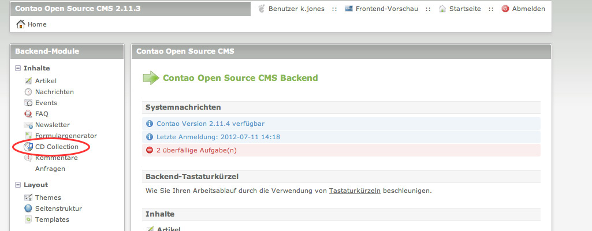
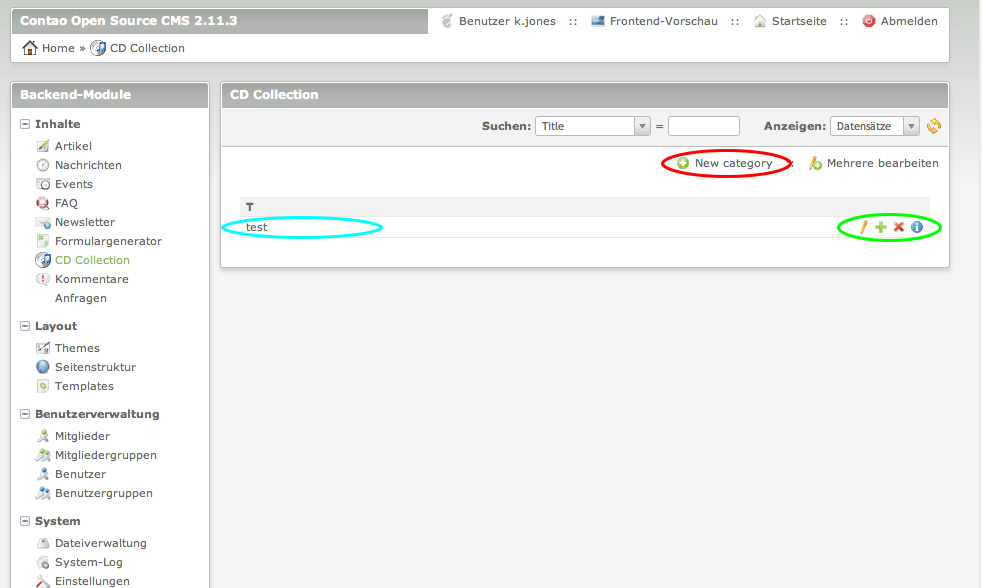
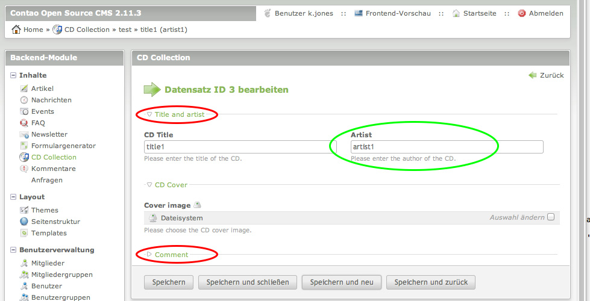

# Contao Module Overview

## Description

This tutorial explains how and where labels of a module are stored with the help of screenshots and code-snippets.


## Frontend-Labels

The labels in the frontend are simple. Most of the time they are stored in the associated language file of the given table. In this example it's the 'apartment' table.

___

### Labels for DCA-defined-fields

The mapping between the field and the label is usually done with the field-key that was given in the DCA definition of said table.


**Example:** 

/propertymanager/languages/en/tl\_apartment.php
```php
<?php

/**
 * Fields
 */
$GLOBALS['TL_LANG']['tl_apartment']['price']			= array('Price', 'Please enter the price.');
$GLOBALS['TL_LANG']['tl_apartment']['additionalCosts']	= array('Additional costs', 'Please enter the additional costs');

// ...

?>
```

---

### Custom-Labels

In case you wish to have additional labels defined in a language-file you can easily do so by writing something like the code below. 

It doesn't have to be the 'custom_label'-key, you can choose whatever you want, but I suggest you group them in their own array:

```php
<?php

/**
 * Fields
 */

// custom labels 

$GLOBALS['TL_LANG']['tl_apartment']['custom_label']['icon_alt']	= 'This is the alternative text of an image';
$GLOBALS['TL_LANG']['tl_apartment']['custom_label']['label1']	= 'This is a label that can be used for whatever you want';

// ...

?>
```
To use those in a template, I suggest you do the following in the module/content element: 

```php
<?php
	$this->Template->custom_labels = $GLOBALS['TL_LANG']['tl_apartment']['custom_label'];
?>
```
In the template they can then be accessed like this.
<?php echo $this->icon_alt; ?> and <?php echo $this->label1; ?> 

**Note:** Make sure the language file is loaded (see below).

---


Sometimes you might want to use a specific language file. To load any language file manually, use the following. In this case it's the language file 'tl_apartment.php' from the examples above:

```php
<?php
	$this->loadLanguageFile('tl_apartment');
?>
```


It doesn't have to be the label-file of a table, in case you had a */languages/en/various\_labels.php* and wanted to use it, do this:
```php
<?php
	$this->loadLanguageFile('various_labels');
?>
```

**Note:** For 'loadLanguageFile' to work, the language files must be part of the same module:


## Backend-Labels





### Module-Navigation Element

The module is added in the config-file config.php (in \<module-folder\>/config/).
It needs to be added to the global $GLOBALS['BE_MOD'].

For example, if the module should be added to the first group of elements (Inhalt/Content).

The easiest way to do this is like this, but the element will be placed last below all the others in the content group.


**Example:** 

/cd\_collection/config/config.php
```php
<?php
	
	// Back end module
	$GLOBALS['BE_MOD']['content'][] = array(
	'cd_collection' => array
  	(
   		'tables' => array('tl_cds_category', 'tl_cds'),
   		'icon'   => 'system/modules/cd_collection/html/icon.gif'
  	)
  	);

?>
```

In case you want to control the position, you can use the "array\_insert" function:


```php
<?php

	// Back end module
	array_insert($GLOBALS['BE_MOD']['content'], 3, array
	(
  	'cd_collection' => array
  	(
   		'tables' => array('tl_cds_category', 'tl_cds'),
    	'icon'   => 'system/modules/cd_collection/html/icon.gif'
  	)
	));
?>
```

In both cases the line with the icon is voluntary.


### Modulename Label


To set a language-dependent module label you need to edit/create the file **modules.php** (for english in \<module-folder\>/languages/en) and add a line like this. 
**Note:**  The array-key 'cd\_collection' needs to be identical to the one that was defined in the config file.

**Example:** 

/cd\_collection/languages/en/modules.php
```php
<?php

	/**
 	 * Back end modules
 	 */
	$GLOBALS['TL_LANG']['MOD']['cd_collection'] = array('CD Collection', 'Manage your CD collection.');
?>
```
---
For the frontend-name it's very similiar: 

```php
<?php
	/**
	 * Front end modules
	 */
	$GLOBALS['TL_LANG']['FMD']['cd_collection'] = array('CD Collection list', 'adds a list of cds to your page.');
?>
```
---
For a content element label the syntax is very similar, but it belongs in a different file, namely the **default.php** (for english in \<module-folder\>/languages/en):

**Example:** 

/propertymanager/languages/en/default.php

```php
	<?php
	/**
	 * Content Elements
	 */
	$GLOBALS['TL_LANG']['CTE']['propertymanager'] 				= 'Liegenschaftsmanagment';
	$GLOBALS['TL_LANG']['CTE']['apartment_list'] 				= array('Wohnungsliste');
?>
```


### Module Labels




To set language-dependent module buttons (green ellipse in the screenshot) you need to edit/create the file \<table-name\>.php (for english in \<module-folder\>/languages/en) and add the following lines:

**Example:** 

/cd\_collection/languages/en/tl\_cds\_category.php

```php
<?php
	/**
  	 * Buttons
 	 */
	$GLOBALS['TL_LANG']['tl_cds_category']['new']    = array('New category', 'Create a new category'); // also in red ellipse
	$GLOBALS['TL_LANG']['tl_cds_category']['show']   = array('Category details', 'Show details of category ID %s');
	$GLOBALS['TL_LANG']['tl_cds_category']['edit']   = array('Edit category', 'Edit category ID %s');
	$GLOBALS['TL_LANG']['tl_cds_category']['copy']   = array('Copy category', 'Duplicate category ID %s'); 
	$GLOBALS['TL_LANG']['tl_cds_category']['delete'] = array('Delete category', 'Delete category ID %s'); 	
	
	// additional buttons (if needed)	
	$GLOBALS['TL_LANG']['tl_cds_category']['show']			 = array('Page details', 'Show details of page ID %s');
	$GLOBALS['TL_LANG']['tl_cds_category']['pasteafter']	 = array('Paste after', 'Paste after page ID %s');
	$GLOBALS['TL_LANG']['tl_cds_category']['pasteinto']		 = array('Paste into', 'Paste into page ID %s');

?>
```
Table-name equals 'tl\_cds\_category' in this example. The second value of each array defined the description, which is usually used for the mouseover tooltip-text. Contao replaces the '%'-character with the id of the given element. 


The individual label of a given entry (turquoise ellipse) is defined in the DCA. (for english in \<module-folder\>/dca/\<table-name\>.php), see the code-snippet below:


**Example:** 		 

/cd\_collection/dca/tl\_cds\_category.php

```php
<?php

	$GLOBALS['TL_DCA']['tl_cds_category'] = array
	(

		// Config
		'config' => array
		(
			'dataContainer'               => 'Table',
			'ctable'                      => array('tl_cds'),
			'switchToEdit'                => true
		),

		// ...
		
		'label' => array
		(
			'fields'                  => array('title'),
			'format'                  => '%s'
		),

		// ...
?>
```
The relevant part is the one with the label. In 'fields' you preselect the table-columns you want to display (1 - n), and in 'format' you define how exactly those fields should be displayed/formatted. 
Here the column is only displayed, but in case you'd wish to display '[test]' instead of 'test', you could do so easily by writing:

```php
<?php
	// ...
	
	'label' => array
	(
			'fields'                  => array('title'),
			'format'                  => '[%s]'
	),
	
	// ...
?>
```

Should you wish to also display the description, you could do so:

```php
<?php
	// ...
	
	'label' => array
	(
			'fields'                  => array('title', 'description'),
			'format'                  => '%s, %s'
	),
	
	// ...
?>
```

This would display both values, separated by a comma.


### Module Edit-View Labels




#### Field-Labels

The language-dependent fields label and description (green ellipse in the screenshot) are defined in the file \<table-name\>.php (for english in \<module-folder\>/languages/en), they look as follows:

**Example:** 

/cd\_collection/languages/en/tl\_cds.php
```php
<?php
	/**
	 * Fields
	 */
	$GLOBALS['TL_LANG']['tl_cds']['title']   = array('CD Title', 'Please enter the title of the CD.');
	$GLOBALS['TL_LANG']['tl_cds']['artist']  = array('Artist', 'Please enter the author of the CD.');
	$GLOBALS['TL_LANG']['tl_cds']['image']   = array('Cover image', 'Please choose the CD cover image.');
	$GLOBALS['TL_LANG']['tl_cds']['comment'] = array('Comment', 'Please enter your comment about CD.');
	
	// ...
?>
```
In this case it's for the table 'tl\_cds'. The array-key refers to the definition in the DCA. First value is the actual name of the field, the second one a description (tooltip).


#### Legends

The language-dependent legends (red ellipse in the screenshot) you need to edit/create the file \<table-name\>.php (for english in \<module-folder\>/languages/en) and add the following lines:

```php
<?php
	// ...
		
	/**
	 * Legends
	 */
	$GLOBALS['TL_LANG']['tl_cds']['title_legend']   = 'Title and artist';
	$GLOBALS['TL_LANG']['tl_cds']['image_legend']   = 'CD Cover';
	$GLOBALS['TL_LANG']['tl_cds']['comment_legend'] = 'Comment';

	// ...
?>
```

In this case it's for the table 'tl_cds'. 


